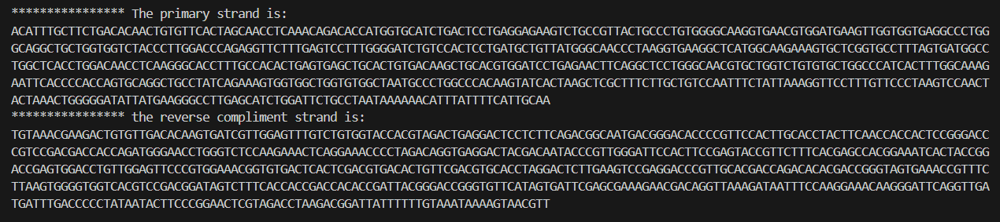

<h1>ORF Gene Reader</h1>
<h3>About</h3>
<text>This is a python based bioinformatics tool for analysing DNA sequences from FASTA files and identifying open reading frames (ORFs) across all six possible reading frames.</text>
<h3>Goal</h3>
<ol>
  <li>Read a DNA sequence from FASTA file</li>
  <li>Generate the complementary and reverse complementary strands</li>
  <li>Translate codons into amino acids</li>
  <li>Display amino acid sequences for all six reading frames</li>
</ol>
<h3>How it Works</h3>
<h4>1. FASTA Input</h4>

Run the script using:

<pre><code class="language-bash">python readORF.py</code></pre>

Then select the FASTA file

The program reads the a FASTA file and extracts

<ul>
  <li>Description/header line</li>
  <li>DNA sequence data</li>
  <li>Newline characters(for continous nucleotide sequence)</li>
</ul>
<h4>2. Complementary and Reverse Complenetary Strands</h4>

The complementary strand is generated using stabdard base pairing rules:

<table>
  <thead>
    <tr>
      <th>Base</th>
      <th>Complement</th>
    </tr>
  </thead>
  <tbody>
    <tr>
      <td>A</td>
      <td>T</td>
    </tr>
    <tr>
      <td>T</td>
      <td>A</td>
    </tr>
    <tr>
      <td>C</td>
      <td>G</td>
    </tr>
    <tr>
      <td>G</td>
      <td>C</td>
    </tr>
  </tbody>
</table>
<h4>3. Reading Frames</h4>

A DNA sequence can be translated started at three different offsets

<ul>
  <li>Frame 1: The primary sequence 5' to 3' starting at index 0</li>
  <li>Frame 2: The compliment sequence 3' to 5' starting at index 1</li>
  <li>Frame 3: The reverse compliment 5' to 3' starting at index 2</li>
</ul>

Each frame produces a different grouping of codons.

The program performs translations for:

<ul>
  <li>RF1, RF2, RF3 (primary strand)</li>
  <li>RF-1, RF-2, RF-3 (reverse complement</li>
</ul>

<h4>4. Translation</h4>

The script uses a codon table dictionary to map DNA triplets to amino acids.

Example:

ATG → M (Methionine)

TGG → W (Tryptophan)

TAA → * (Stop codon)

